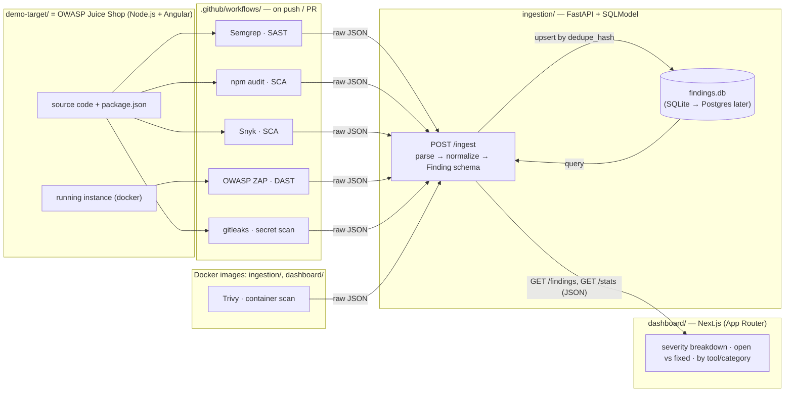

# Overall Solution Architecture

How SAST, SCA, DAST, secret, and container scanner output all become one
normalized, queryable findings database — and the dashboard that reads it.

The dashboard never talks to the scanners or the database directly — only to
the ingestion API's read endpoints. Every scanner's output is collapsed into
one `Finding` shape before it's stored, deduplicated by `dedupe_hash` so
repeat scans update `last_seen` instead of creating duplicate rows.

## Scanner coverage

| Category            | Tool         | What it tests                                                  |
| -------------------- | ------------ | ---------------------------------------------------------------- |
| SAST                 | Semgrep      | Juice Shop's own source code, for unsafe patterns                |
| SCA                  | npm audit    | Juice Shop's `package.json` dependencies, against the GitHub Advisory DB |
| SCA                  | Snyk         | Same dependencies, against Snyk's broader vuln DB + remediation advice |
| DAST                 | OWASP ZAP    | The **running** Juice Shop instance, black-box, like an external attacker |
| Secret scanning       | gitleaks     | Git history for committed keys/tokens/passwords                  |
| Container scanning     | Trivy        | The `ingestion/` and `dashboard/` Docker images, for vulnerable base images/packages |

IaC scanning (Checkov/tfsec) is intentionally out of scope for now — there's
no Terraform/CloudFormation/K8s manifests in this project yet. Worth adding
if this ever gets deployed to real cloud infrastructure rather than run via
`docker compose` locally.

## Deduplication

There's no single dedup field shared across scanners. [`compute_dedupe_hash`](ingestion/app/dedupe.py)
just SHA-256s whatever parts it's given (joined with `|`) — each parser
decides for itself which fields make a finding unique for that scanner type,
then the ingestion API upserts on the resulting hash so a repeat scan updates
`last_seen` on the existing row instead of inserting a duplicate.

| Scanner | Hashed on | Why |
| ------- | --------- | --- |
| Semgrep (SAST) | `source, repo, rule_id, file_path, line_number` | Same rule can fire at many locations in one repo — each location is a distinct finding. |
| gitleaks (secrets) | `source, repo, rule_id, file_path, line_number` | Same reasoning as SAST: location makes the finding unique. |
| npm audit (SCA) | `source, repo, rule_id, package_name` | One advisory (`rule_id`) can apply to several packages — package name is what makes two rows the same issue. |
| Snyk (SCA) | `source, repo, rule_id, packageName` | Same as npm audit. |
| Trivy (SCA/container) | `source, repo, rule_id, PkgName, target` | Same as above, plus `target` (image/file) since one scan can cover multiple images. |
| OWASP ZAP (DAST) | `source, repo, rule_id, endpoint` | A web vuln is scoped to a URL/route, not a file/line. |

Every scanner's hash also includes `source` and `repo`, so two different
tools can never collide even if their other fields happen to match.

## Bill of materials

| Item | Component              | Spec                                                                                                                              |
| ---- | ----------------------- | ----------------------------------------------------------------------------------------------------------------------------------- |
| 01   | `demo-target/`           | OWASP Juice Shop, run via its official Docker image — a well-known, intentionally-vulnerable app (SQLi, XSS, broken auth, vulnerable deps) with an active challenge tracker. |
| 02   | `.github/workflows/`     | Runs Semgrep, npm audit, Snyk, gitleaks against the source; runs Juice Shop in a container and points ZAP's baseline scan at it; runs Trivy against the built `ingestion/`/`dashboard/` images. Posts every tool's raw output to the ingestion API. |
| 03   | `ingestion/`             | FastAPI + SQLModel service. Per-scanner parsers map raw output onto the shared `Finding` schema, dedupe by hash, and upsert into SQLite. |
| 04   | `dashboard/`             | Next.js app reading the ingestion API's `/findings` and `/stats` endpoints — severity breakdown, open vs. fixed, trend over time, by tool/category. |

## Severity levels

`critical` · `high` · `medium` · `low` · `info` — see [`Severity`](ingestion/app/schema.py) in the shared schema.
