# Build Plan

Phased checklist for `vigilant-engine`. See [ARCHITECTURE.md](ARCHITECTURE.md)
for the target shape, and [docs/PRD.md](docs/PRD.md) for the product
requirements this plan implements.

## Phase 0 — Docs

- [x] `ARCHITECTURE.md` — solution architecture, scanner coverage, bill of materials
- [x] `ingestion/app/schema.py` — shared `Finding` / `IngestRequest` models
- [x] `Plan_vigilant_engine.md` (this file)
- [x] `docs/THREAT_MODEL.md` — manual STRIDE analysis of Juice Shop (confirmed findings, in progress)
- [x] `docs/BURP_TESTING_STEPS.md` — live runbook for hands-on Burp Suite testing
- [x] `docs/STRIDE_METHODOLOGY.md` — STRIDE process notes, what to test per category
- [x] `docs/vigilant-engine-threat-modeling-plan.pdf` — phased threat-modeling plan (STRIDE + Threat Dragon + ATT&CK)

## Phase 1 — demo-target

- [x] `demo-target/` — OWASP Juice Shop brought in as a git submodule, pinned
      to release `v20.2.0` (not `main`, so scan results are reproducible)
- [x] Confirm it boots and is reachable on a known port — `npm install && npm
      start` in `demo-target/`, verified `200` on `localhost:3000`. Ran
      natively rather than via Docker since Docker isn't installed locally
      yet; GitHub Actions provides Docker for CI, so this doesn't block CI
      work later.
- [x] Re-check Juice Shop still loads fine locally — `npm start` in
      `demo-target/`, verified `200` on `localhost:3000`.

## Phase 2 — ingestion service (`ingestion/`) — done

Validated two ways: (1) unit/integration tests against dummy fixture data
per scanner, (2) one real `npm audit` scan of Juice Shop posted through
`/ingest` end-to-end.

Needs a database, just not a heavyweight one: SQLite (a single
auto-created file, `findings.db`) stands in for Postgres so the flow below
can be proven with zero setup. Swapping in real Postgres later is a
one-line `DATABASE_URL` change.

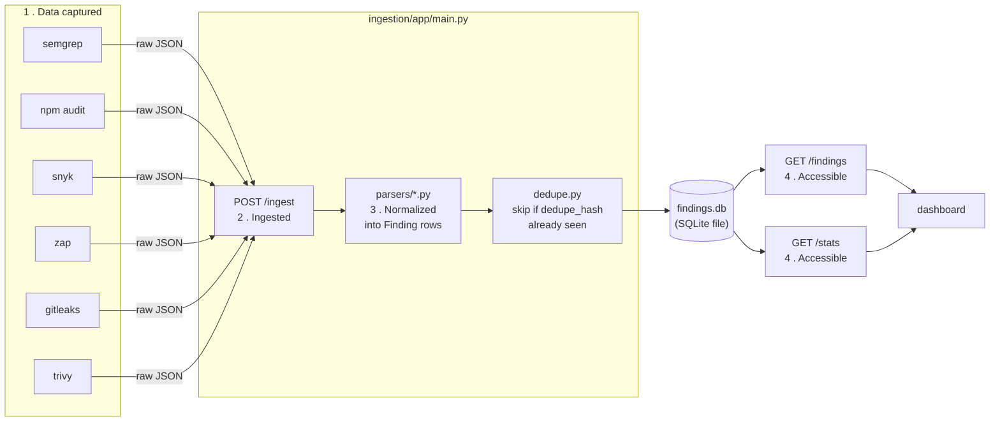

- [x] `app/db.py` — SQLModel engine + session, SQLite for now
  - SQLModel = a Python library that lets a class double as both a
    type-checked model and a database table; it opens the connection to
    `findings.db` and hands each request its own session
- [x] `app/models.py` — `Finding` as a SQLModel table (reuses `schema.py`'s shape)
  - like a JPA `@Entity`: one class is both the object you code against
    and the table definition, instead of a separate POJO + XML/annotation
    mapping + DAO
- [x] `app/dedupe.py` — `compute_dedupe_hash()`, shared by every parser
  - dedup so re-running the same scan doesn't create a new row for a
    finding already known — it hashes only the fields that identify
    *what* the issue is (rule + file + line, etc.), never *when* it was
    found, so a repeat scan just updates `last_seen` on the existing row
    instead of the table growing forever with the same bug
- [x] `app/parsers/` — one module per tool, each mapping raw scanner JSON to `Finding`:
  - parsing = taking each scanner's own raw shape and normalizing it into
    the one common `Finding` structure — see `app/models.py`'s `Finding`
    class for the target fields: `source`, `rule_id`, `title`, `severity`,
    `repo`, `file_path`, `dedupe_hash`, etc.
  - [x] `semgrep.py`
  - [x] `npm_audit.py`
  - [x] `snyk.py`
  - [x] `zap.py`
  - [x] `gitleaks.py`
  - [x] `trivy.py`
- [x] `app/main.py` — FastAPI app:
  - this is the backend that gives us clean, ingested data to present on
    the dashboard — everything above feeds into it
  - [x] `POST /ingest` — dispatch to the right parser by `source`, upsert by `dedupe_hash`
  - [x] `GET /findings` — filter by severity/source/status/repo
  - [x] `GET /stats` — counts by severity/source, for the dashboard
- [x] `tests/fixtures/` — one sample raw-output file per tool
- [x] `tests/test_parsers.py` — each parser vs. its fixture (7 tests)
- [x] `tests/test_api.py` — `/ingest` → `/findings`/`/stats` end-to-end, incl. dedupe-on-rescan (6 tests)
- [x] Validated with a real `npm audit` scan of Juice Shop — all 46 real findings normalized correctly
- [x] `ingestion/README.md` — code layout, sequence diagrams, how to run/test

## Phase 3 — CI (`.github/workflows/`)

**Approach.** So far every scan was triggered by hand. Phase 3 automates
that with a GitHub Actions pipeline: every push to Juice Shop triggers a
run of all six scanners, feeding straight into the same ingestion API.
Bottom line — the full scan happens automatically on every code change,
not just when someone remembers to run it.

Set up and run the scanners:

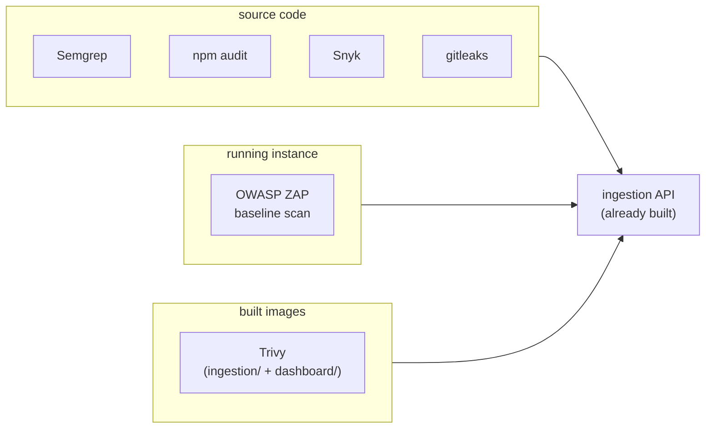

> **What is Trivy?** A scanner for container images (not source code) — it
> looks inside a *built* Docker image and flags known-vulnerable OS
> packages and dependencies baked into its layers. That's why it runs
> against `ingestion/`'s and `dashboard/`'s images, after they're built,
> rather than against source like the others.

**Job flow, step by step (`security-scans.yml`, `scan-and-ingest` job).**
One job, one runner VM, every step below executing on it in order:

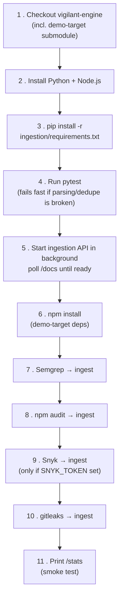

One job, one runner VM — each step above runs in order, and steps 7-10
each hand their tool's raw output to the same ingestion API before the
next scanner starts.

- [x] Workflow: run Semgrep, npm audit, Snyk, gitleaks against `demo-target/` source
  - `.github/workflows/security-scans.yml` + `.github/scripts/post_to_ingestion.py`
  - Verified on a real run: [run 34469209245](https://github.com/creativecoder10/vigilant-engine/actions/runs/34469209245)

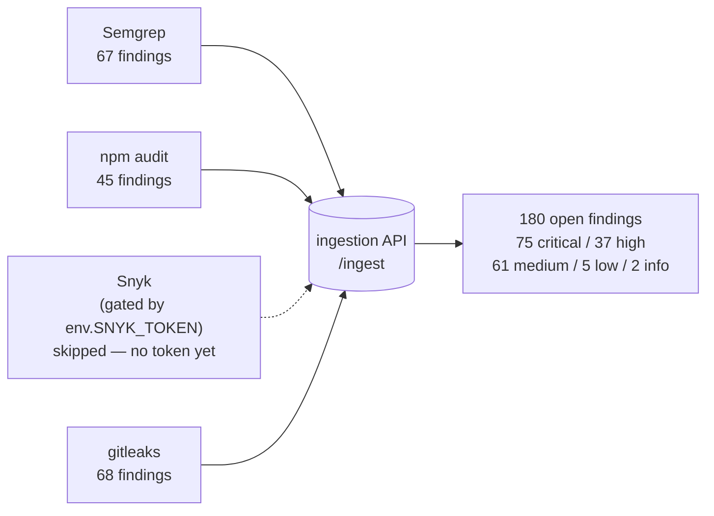

> **2 real bugs, only visible once run on GitHub's actual runner:**
> 1. `secrets` can't be read inside an `if:` expression — moved
>    `SNYK_TOKEN` into a job-level `env:` var instead.
> 2. npm 10.9.8 (bundled with Node 22 on the runner) crashed on
>    `demo-target`'s nested install, a known Arborist bug — fixed by
>    force-upgrading npm first. Didn't reproduce locally on npm 11.x.
>
> Full diagnosis: `docs/FIRST_CI_RUN_EXPECTATIONS.md`.

**Next up — ZAP (DAST) + Trivy (image scan): what and why.**

Everything ingested so far inspects source or manifests. These two test
different targets entirely:

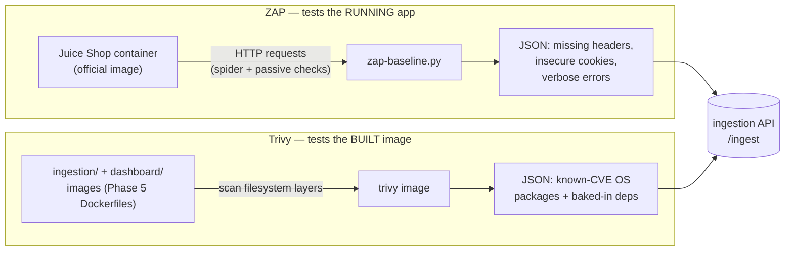

> **Test-type classification — neither of these is IaC or "platform"
> security testing.** ZAP = **DAST** (Dynamic Application Security
> Testing) — application layer, exercises the running app over HTTP. Trivy
> here = **container/artifact image scanning** — closer to SCA, but
> scoped to a built image's layers (OS packages + baked-in deps) instead
> of a source manifest. **IaC scanning** (checking Terraform/CloudFormation
> for misconfigurations — public S3 buckets, open security groups) is a
> different category entirely, out of scope until Phase 8's `tfsec`/
> `checkov` step, which runs against `infra/` once it exists. Trivy the
> *tool* can also do IaC scanning as a separate mode, but this project
> doesn't use it that way — only against built images here.

> **Why not just more SCA?** npm audit/Snyk only see *declared*
> dependencies (`package-lock.json`). Trivy sees what's actually baked into
> the image — base OS packages (Debian/Alpine), anything pulled in via
> `apt`/`RUN`. ZAP goes further still: no code-reading at all, it attacks
> the live app the way a browser/attacker would (baseline mode = passive +
> spider only, not active exploitation).

> **Not blocked.** Trivy needs a *built* image — Phase 5's
> `ingestion/Dockerfile` and `dashboard/Dockerfile` are already built and
> verified, so this is just a `docker build` CI step before `trivy image`,
> not new packaging work.

> **No new ingestion-side code.** `app/parsers/zap.py` and
> `app/parsers/trivy.py` were already built and tested in Phase 2 — this
> phase is CI-workflow wiring only.

- [x] Workflow: boot Juice Shop in a container, run ZAP baseline scan against it
  - `security-scans.yml`: `docker network create` + Juice Shop container +
    poll on `localhost:3000`, then `zaproxy/zap-stable zap-baseline.py -t
    http://juice-shop:3000 -J zap-results.json` on the same network,
    reached by container name (not `localhost`) — the same pattern
    `docker-compose.yml` uses in Phase 5.
  - **Verified locally, not just written:** ran the exact same two-step
    flow by hand — real `bkimminich/juice-shop:v20.2.0` container, real ZAP
    baseline scan, no permission errors on the mounted output volume.
    11 real alerts came back (CSP header missing, cross-domain
    misconfiguration, timestamp disclosure, etc.), posted through
    `/ingest`, and confirmed queryable via `GET /findings?source=zap` —
    correct severity/rule_id/description on every row, not just a
    non-empty response.
  - `|| true` on the ZAP step: baseline mode exits non-zero (`2`, here)
    whenever it finds WARN-level alerts — same reason every other real
    scanner step in this workflow has it, finding vulnerabilities isn't a
    CI failure.
- [ ] Workflow: build `ingestion/` and `dashboard/` images, run Trivy against them
- [ ] Each job POSTs its raw output to the ingestion API's `/ingest`

**Why the ingestion API is ephemeral in this phase — a decision, not an
oversight.**

The basic fact: `security-scans.yml` starts the FastAPI ingestion service
as a background process, backed by a fresh SQLite file that lives only on
that job's runner disk. When the job ends, the runner VM — disk, database,
everything — is destroyed. So every run starts from zero findings; nothing
accumulates across runs yet.

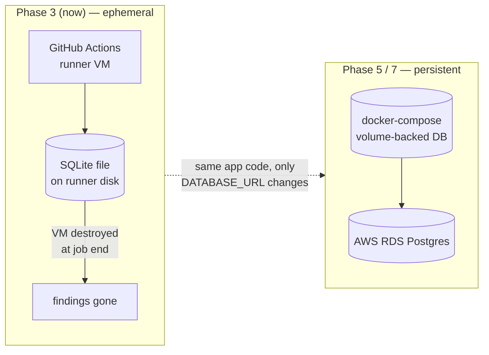

**Why do it this way — walking-skeleton approach:**
- Build the thinnest slice that exercises the *entire* path end-to-end
  with the cheapest components first, validate it, *then* add real infra.
- A real always-on DB brings problems unrelated to "does the pipeline
  work" — hosting cost, giving CI a write credential securely, backups,
  migrations.
  - Bundling those into Phase 3 would turn a fast, cheap-to-debug step
    into a slow, hard-to-isolate one.
- Sequencing: persistence lands in **Phase 5** (`docker-compose` + a
  volume-backed DB) and **Phase 7** (AWS RDS Postgres) — not a rewrite,
  since `ingestion/app/db.py` already reads `DATABASE_URL` from an env var.
- Phase 4's dashboard is scoped the same way: it queries the future
  persistent API, never a short-lived per-CI-run instance — a CI job
  ending was never meant to be what makes the dashboard go blank.

> **Not the same as run history.** This closes *persistence* (the DB
> survives a restart), not a queryable "how did findings change run to
> run" — that needs a separate `scan_runs` table (one row per scan run,
> snapshotting open-finding counts by severity at that moment), tracked as
> its own Phase 5 item. Full writeup: `docs/PRD.md`, §5 "Known gap: run history".

**Outcome — the test suite is now a gate, before any scanner runs.**
Before: `pytest` had no connection to CI at all — `ingestion/tests/`
(`test_parsers.py`, `test_api.py`) only ever ran locally.

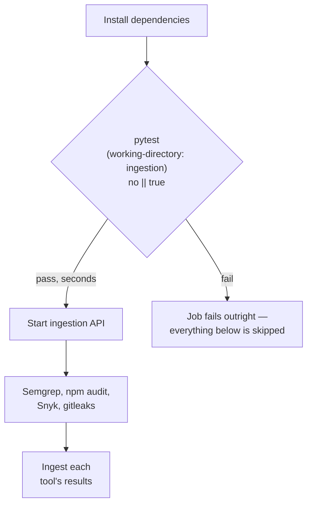

- **No `|| true` on this step**, unlike the scanner steps — a failing test
  fails the whole job, so GitHub Actions skips every step after it by
  default (start API, run scanners, ingest).
- **Fail-fast payoff:** a broken parser is now caught in seconds, instead
  of the job burning several minutes running every real scanner first and
  *still* never having checked whether the ingestion logic underneath them
  was sound.
- This is the standard shape of "CI enforces the test suite" — a fast,
  narrow gate placed first, before the more expensive integration work.

**Scope clarifications — Q&A.**

*Q: Why install Node.js if two of the four scanners are static analysis
against source code — isn't that language-agnostic?*

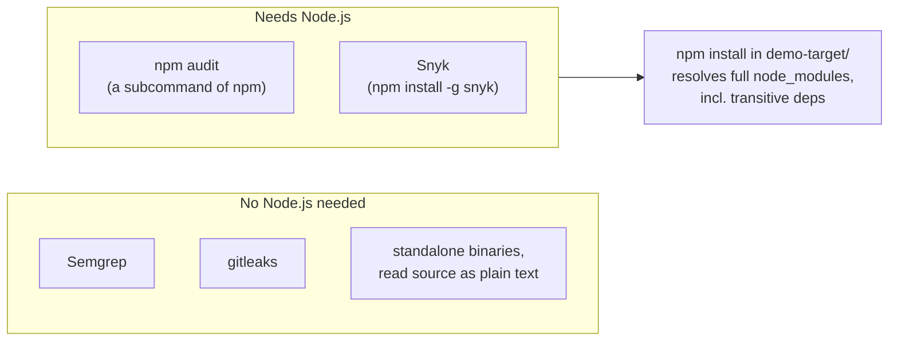

A: Yes for Semgrep/gitleaks — no Node.js involved. But `npm audit` and
Snyk are themselves npm-ecosystem tools, so neither runs at all without
Node.js, regardless of what they're scanning. None of this is dynamic
scanning either — Juice Shop is never started as a live app in this
workflow; that's ZAP's job, added as its own separate step further below.

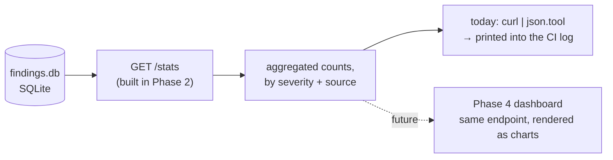

A live query against the database, printed for this run and thrown away.
Nothing is written to disk; the same endpoint is what Phase 4's dashboard
will call to render real charts instead of log text.

*Q: Does "ingest" mean take the scanner's raw output, normalize it, and
write it into the SQLite database?*

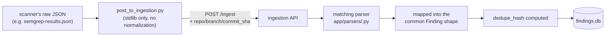

A: Yes. The script's only job is delivering the raw file to the API — all
normalization, hashing, and persisting happens inside the API itself.

**Outcome reporting for each run.** Three artifacts make a run inspectable
without opening the raw job log — all built on existing infra, no new
dependency or third-party Action:

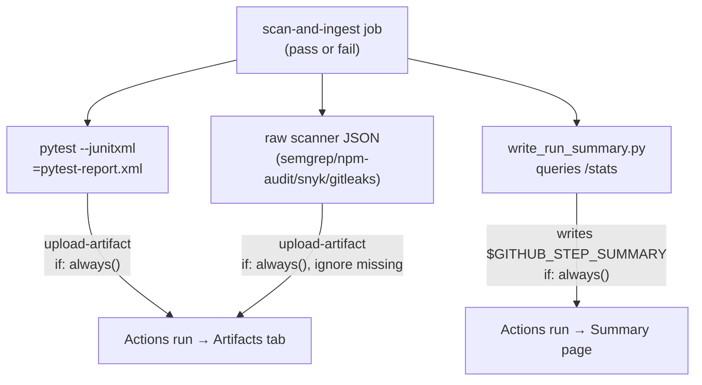

- [x] **Test report** — attached even on failure; the ephemeral-disk
      problem above means without this explicit upload it would vanish
      with the rest of the runner's disk.
- [x] **Raw scanner output** — lets a run's raw tool output be inspected
      later without re-running anything (`snyk-results.json` is allowed
      to be missing when `SNYK_TOKEN` isn't set).
- [x] **Ingestion + per-scanner summary** — rendered as markdown on the
      run's summary page instead of buried in log text; if the API was
      never started (e.g. `pytest` failed upstream) it catches
      `URLError` and reports "API was not reachable" instead of crashing.

Not yet verified against a real run — nothing has been pushed to a GitHub
remote yet.

## Phase 4 — dashboard (`dashboard/`)

> Visual map of `dashboard/src/` — annotated file tree (Server vs. Client
> Components) plus a request-flow diagram from browser to SQLite:
> `docs/dashboard-anatomy.html`.

- [x] Next.js app scaffold (App Router + TypeScript, Tailwind) —
      `create-next-app`, npm.
- [x] `src/lib/api.ts` — typed server-side client (`getFindings`,
      `getStats`) against the ingestion API. Reads `INGESTION_API_URL`
      from the environment (defaults to `http://localhost:8000`); no
      `NEXT_PUBLIC_` prefix since it only ever runs in Server Components,
      never shipped to the browser.
- [x] `src/types/finding.ts` — TS types mirroring `Finding`/`Severity`/
      `Source`/`FindingStatus`/`Stats` from `ingestion/app/schema.py` and
      `models.py`. Hand-kept in sync, not codegen'd — same tradeoff noted
      in `Finding`'s own docstring.
- [x] `src/components/` — `SeverityStats` (stat tiles), `SourceBreakdown`
      (per-scanner bar chart), `FindingsTable`.
  - Colors follow the dataviz skill's method rather than eyeballed
        choices: severity uses the fixed status ramp
        (critical/serious/warning/good; `info` falls back to muted ink
        since it isn't a status level in the same sense), and scanner
        source uses the fixed 6-slot categorical ramp — both run through
        `validate_palette.js` (CVD separation, contrast) before use, in
        both light and dark mode.
  - Identity is never color-alone: a swatch sits *beside* a text label,
        never colors the text itself.
  - [ ] Open-vs-fixed trend — deferred, not just unbuilt: it needs
        history across multiple scans, which needs the `scan_runs` table
        (one row per scan run, snapshotting open-finding counts by
        severity at that moment) gap already flagged in Phase 3
        (per-finding `first_seen`/`last_seen` isn't the same as a
        queryable run history). The table itself now exists (Phase 5) —
        this item is now just the dashboard chart reading it, not blocked
        on missing data anymore.
- [x] Landing page (`src/app/page.tsx`) pulling real data from
      `getFindings({status: "open"})` and `getStats()`.
  - **Verified, not just built:** local ingestion API seeded with the
        actual raw scanner output artifact from the successful Phase 3 CI
        run (180 real findings, same numbers as the live run) — `npm run
        build`/`lint` clean, then screenshotted with Playwright in both
        light and dark mode, zero console/page errors.
- [x] Severity/criticality filter — `SeverityStats`' tiles double as the
      filter control (pattern checked against a reference app,
      `threat-pulse-kappa.vercel.app`'s alert feed): clicking a tile sets
      `?severity=<x>`, read server-side via the page's `searchParams`
      prop and passed straight into the existing typed `getFindings()`
      call — the real `/findings?severity=` query runs, not a
      client-side filter over an already-fetched array.
  - **Verified end-to-end:** clicking "Critical" produces exactly 75
        rows, all `severity=critical`, confirmed by reading the rendered
        table's actual cell values, not just the URL changing.

## Phase 5 — packaging — done

**What `docker compose up` actually does, behind the scenes:**

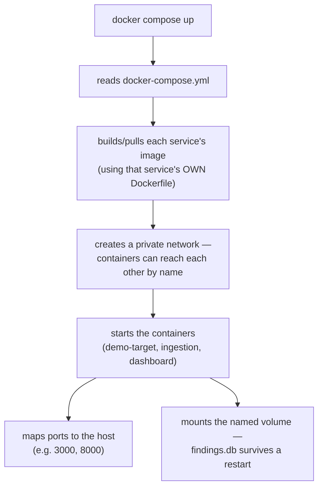

Correcting one mental model: it's less "list dependencies to install and
code to copy" (that's each Dockerfile's job) and more "which containers to
start, how they reach each other by name, which ports reach the host, and
which folder survives a restart." It's the orchestration layer sitting on
top of the Dockerfiles, not a replacement for them.

**`ingestion/Dockerfile`** — builds one image for the ingestion service:

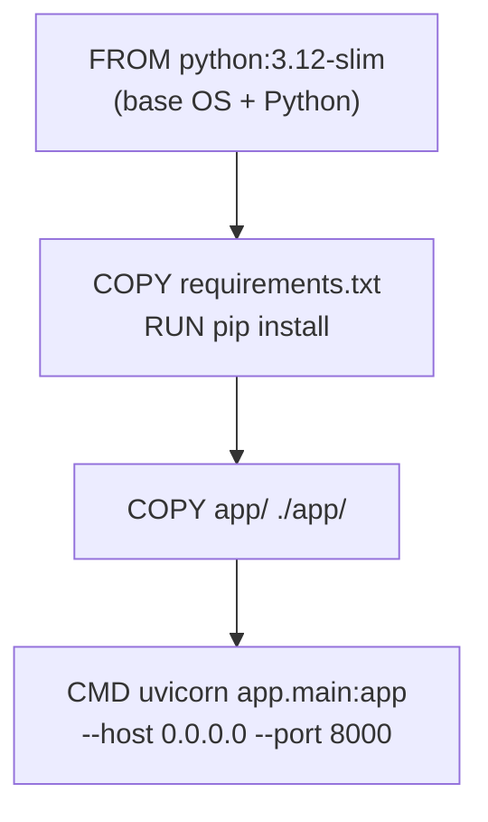

> **Why `-slim`?** Same Python, minimal Debian base — no compilers, docs,
> or extra OS packages that a full image ships. Smaller image (faster
> pulls in CI) and a smaller attack surface (fewer OS packages = fewer
> things Trivy can flag, see Phase 3). Deps are copied and installed
> *before* app code so Docker's layer cache skips the slow `pip install`
> on every code-only change.

**`dashboard/Dockerfile`** — same idea, but multi-stage since Next.js needs
a build step first:

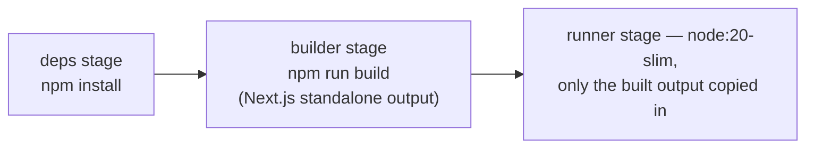

> Multi-stage keeps the *final* image slim: `deps`/`builder` need the full
> Node toolchain to build the app, but `runner` — what actually ships and
> runs — only needs the compiled output. Build tools never make it into
> the running image.

**`docker-compose.yml`** — not a third Dockerfile. It doesn't install
dependencies or copy code itself; that's each service's own Dockerfile,
already built above. What it does is wire the *already-built* containers
together:

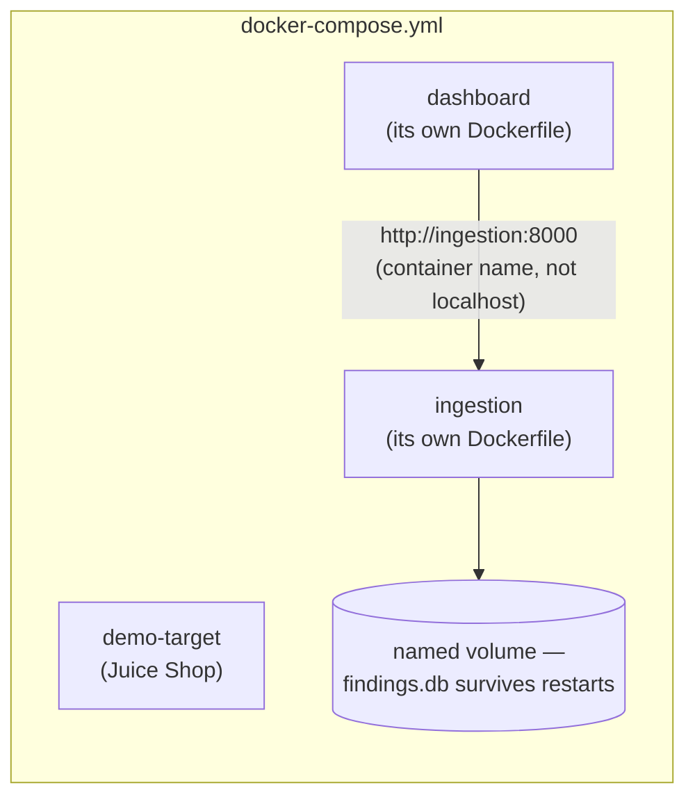

- [x] `ingestion/Dockerfile` — built and verified: `docker build` succeeds,
      `docker run -p 8001:8000` responds on `/docs` (200), `/findings`
      (`[]`), `/stats` (zeroed counts) — confirms the `0.0.0.0` binding
      actually works through Docker's host port mapping, not just in theory.
- [x] `dashboard/Dockerfile` — built and verified together with `ingestion`
      on a real Docker network: `dashboard` fetched real data from
      `http://ingestion:8000` (container name, not `localhost`) and
      rendered with no error boundary — proves the container-to-container
      networking `docker-compose.yml` will
      formalize actually works.
- [x] Root `docker-compose.yml` wiring demo-target + ingestion + dashboard
      together — named volume (`findings_data`) mounted at `/app/data`,
      `DATABASE_URL` pointed at `./data/findings.db`, `dashboard` reaching
      `ingestion` via `http://ingestion:8000`. **Verified with a real
      persistence test, not just "should work":** seeded a finding via
      `/ingest`, ran `docker compose down` (full teardown — containers and
      network removed) then `docker compose up -d` (brand new containers),
      and `/stats` still showed the same finding — the volume actually
      works, proven end-to-end.
- [x] `scan_runs` table (`ingestion/app/models.py`'s `ScanRun`) — one row
      per scan run (timestamp, repo/branch/commit, per-severity counts at
      that point), distinct from `Finding`'s per-row `first_seen`/
      `last_seen`: answers "how did the count change over time," which
      per-finding rows can't. `POST /scan-runs` computes and records a
      snapshot from current open findings (never trusts counts from the
      caller, so a row can't drift from `/findings`); `GET /scan-runs`
      lists them oldest-first. Verified against the real compose stack:
      seeded findings, recorded two snapshots, confirmed `total_open`
      moved 1 → 3 and `critical` moved 0 → 1 across them — real trend
      data, not just a table that exists unused. Unblocks Phase 4's
      deferred open-vs-fixed trend chart (the chart itself still isn't
      built — this is the data it would read).
- [x] `README.md` — one-command local run instructions:
      `git submodule update --init && docker compose up --build`, plus the
      three URLs to open and a curl seed example. **Verified, not just
      written:** confirmed `git submodule status` requires the init step
      (demo-target is empty without it), and ran the exact `docker compose
      down -v` claimed to wipe `findings.db` — `total_open` went 13 → 0,
      proving the volume-vs-`-v` distinction documented there is accurate,
      not just asserted.

**Optional — parking lot, not yet decided, revisit later.** See
[docs/ACTION_ITEMS.md](docs/ACTION_ITEMS.md) for the reasoning behind
each. Not scheduled into this or any phase; recorded so it isn't lost:

- [ ] Real Snyk integration — optional, but directly upgrades "adjacent
      Snyk exposure" to genuine hands-on CLI/SCA experience for interview
      framing. Steps and verification target in
      [docs/SNYK_PHASE3_APPLICATION.md](docs/SNYK_PHASE3_APPLICATION.md).
- [ ] Cross-check `docs/juice-shop-threat-model.json` (this project's
      rebuild) against `demo-target/threat-model.json` (Juice Shop's own
      official model) for anything missed.

## Phase 6 — polish

- [ ] Run the full pipeline once end-to-end, seed real findings
- [ ] Screenshot the dashboard for the README / portfolio writeup

## Phase 7 — AWS deployment via Terraform (basic IaC, public demo)

**Before starting this phase, read
[docs/PRD_PHASE7_AWS_DEPLOYMENT.md](docs/PRD_PHASE7_AWS_DEPLOYMENT.md)**
— architecture diagram, the always-on-vs-teardown decision to make
before writing `rds.tf`/`ecs.tf`, and why Kubernetes is deliberately
not part of this phase.

Moves the Phase-5 `docker-compose` stack onto AWS, provisioned through
Terraform instead of clicking through the console — the goal is a real,
reachable public URL. A few security basics are non-negotiable defaults
here rather than deferred work, because they cost nothing extra to get
right the first time: a private-subnet database, no hardcoded secrets,
security groups scoped to only the ports that need to be open. The
automation/hardening/scanning layer (CI-driven deploys, OIDC, tfsec/
checkov, a real least-privilege audit) is deliberately pushed to Phase 8
so this phase stays scoped to "get it running," not "get it running *and*
build a full deploy pipeline around it."

**Out of scope here:** on-demand scanning (a dashboard "run scan now"
button). The pipeline stays push/PR-triggered only until authorization
exists — an unauthenticated trigger on a now-public dashboard would let
anyone on the internet repeatedly kick off scans and rack up GitHub
Actions minutes / AWS cost. See [docs/PRD.md §6](docs/PRD.md).

- [ ] `infra/` — new top-level Terraform root module
  - [ ] `backend.tf` — remote state in an S3 bucket + DynamoDB lock table
        (bootstrapped once by hand or a tiny separate bootstrap module,
        since state can't store itself)
  - [ ] `providers.tf` — AWS provider, pinned version
  - [ ] `network.tf` — VPC, public/private subnets, IGW/NAT, security
        groups scoped to only the traffic that needs to flow (ALB → ECS,
        ECS → RDS) — not wide open by default
  - [ ] `ecr.tf` — one ECR repo per image (`ingestion`, `dashboard`)
  - [ ] `rds.tf` — Postgres (replaces SQLite; `ingestion/app/db.py` already
        anticipates this swap), private subnet only, no public endpoint —
        this is the default-correct way to write this file, not extra effort
  - [ ] `ecs.tf` — ECS cluster + Fargate task defs/services for `ingestion`
        and `dashboard`, sized minimal (portfolio project, not prod scale)
  - [ ] `alb.tf` — Application Load Balancer in front of both services,
        path- or host-based routing
  - [ ] `secrets.tf` — AWS Secrets Manager entries (or Terraform variables)
        for `SNYK_TOKEN`, DB credentials; tasks read via `secrets` block,
        never hardcoded/committed
  - [ ] `iam.tf` — reasonably scoped task execution/task roles, no
        wildcard `*` policies (a deeper least-privilege audit pass is
        Phase 8, not skipped entirely here)
  - [ ] `logs.tf` — CloudWatch log groups for each ECS service
  - [ ] `variables.tf` / `outputs.tf` — ALB DNS name, ECR repo URLs, etc.
- [ ] `infra/README.md` — how to `terraform init/plan/apply`, what a
      teardown (`terraform destroy`) costs to avoid, state-locking caveats
- [ ] First deploy run by hand (`terraform apply` from a local machine) —
      no CI automation yet, that's Phase 8
- [ ] Decide before building: is this actually deployed and left running
      (real, ongoing AWS cost) or built-and-torn-down (`terraform apply` in
      a recorded walkthrough, then `destroy`) — changes whether always-on
      RDS/Fargate/ALB/NAT costs are worth it

## Phase 8 — cloud-security automation (stretch)

Builds on Phase 7's infra: the CI-driven deploy pipeline, credential
handling, and misconfig-scanning layer that turns "I can deploy this" into
"I can deploy this the way a security team would actually require." This
is the half of the original AWS-deployment idea that's specifically about
proving cloud-security judgment, not about getting something public.

- [ ] Extend `.github/workflows/` with a deploy job: build → push to ECR →
      `terraform apply` (or `ecs update-service` for a faster image-only
      path) — gated behind manual approval / a protected branch, not
      auto-deploy on every push
- [ ] Auth to AWS from CI via GitHub OIDC + an assumable IAM role — no
      long-lived AWS access keys stored as repo secrets
- [ ] IaC security scanning: run `tfsec` or `checkov` against `infra/` in CI,
      same pattern as the app scanners in Phase 3 — findings normalized and
      posted through the ingestion API if time allows, otherwise just a CI
      gate
- [ ] Least-privilege IAM audit pass — tighten Phase 7's roles further and
      document the reasoning, rather than leaving "reasonably scoped" as
      the final word

## Phase 9 — AI-generated fix review pipeline

Extends the findings pipeline (Phases 1-4) rather than adding a new
service: takes real findings already in the ingestion DB, has an LLM
propose a fix for each, then runs and documents the validation a human
reviewer would actually do. Full requirements and rationale:
[docs/PRD_FIX_REVIEW.md](docs/PRD_FIX_REVIEW.md).

### 9.1 Select findings

- [ ] Query the real ingestion DB (`GET /findings`) against the actual CI
      run's data — not `ingestion/tests/fixtures/*.json`, which are
      synthetic and don't reflect Juice Shop's real Node/TypeScript
      findings
- [ ] Pick 3-5 findings spanning different remediation shapes: at least
      one Semgrep (SAST/code-patch), one npm audit or Snyk (SCA/version
      bump), and one gitleaks (secret/rotate-and-remove) if the real run
      has one — substitute a second SAST finding of a different CWE
      otherwise
- [ ] Record each selected finding's `id`/`dedupe_hash` up front, so the
      write-up can link back to the exact DB row

### 9.2 Generate proposed fixes

- [ ] For each finding, pull the real vulnerable snippet from
      `demo-target/` at its `file_path`/`line_number`
- [ ] Prompt Claude Code with the normalized finding (rule_id, CWE/OWASP
      tags, description, file/line) plus the real code context; have it
      propose a fix as a diff, not prose
- [ ] Save the exact prompt and Claude's raw, unedited response per
      finding — this has to survive even a "reject" verdict

### 9.3 Draft the review checklist (before running it)

- [ ] Write the checklist's dimensions as a standalone document first:
      applies cleanly, vulnerability actually closed (via a test),
      CWE genuinely addressed (not superficially patched), no behavior
      regression, maintainability
- [ ] Do this before looking at any specific proposed fix, so it's a
      reusable instrument and not reverse-engineered to fit this batch

### 9.4 Apply the checklist and verdict each fix

- [ ] Attempt to apply each patch against the pinned Juice Shop commit
- [ ] Write or reuse a targeted test proving the original attack no
      longer works
- [ ] Run the surrounding test suite / a manual smoke check for
      regressions
- [ ] Write an explicit verdict per finding — Accept / Accept with
      changes / Reject — with reasoning, not just a checklist of ticks
- [ ] If all 3-5 come back clean "Accept," deliberately dig for a harder
      finding or push on the CWE-genuinely-addressed dimension until at
      least one review surfaces something non-trivial — an unbroken
      streak of clean AI fixes is a weaker demonstration than one caught
      problem

### 9.5 Write up

- [ ] One doc per finding: finding → proposed diff → checklist walkthrough
      → verdict
- [ ] Extract the checklist into its own standalone doc, written so
      someone unfamiliar with vigilant-engine could apply it to an
      unrelated AI-proposed fix

### 9.6 (Stretch) Schema integration

- [ ] `fix_review` record (verdict, notes, link to the finding) +
      `FindingStatus.FIXED` transition on "Accept," surfaced on the
      dashboard — only after 9.1-9.5 are done; deferred by default so
      this doesn't expand into unscoped dashboard feature work
