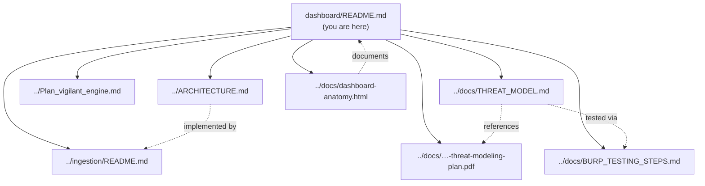

> **Note:** no on-demand "run scan now" trigger belongs on this dashboard until authorization is in place — once it's public (Phase 7), an unauthenticated trigger would let anyone on the internet repeatedly kick off scans and rack up GitHub Actions minutes / AWS cost. Findings display is read-only against the ingestion API; new scans only run on push/PR in CI.

## Start here

This dashboard is one piece of the [vigilant-engine](..) project. The diagram
below shows where this README sits relative to the other docs, and which of
them link to each other.



- [../ARCHITECTURE.md](../ARCHITECTURE.md) — the overall design: what talks to what, and why
- [../Plan_vigilant_engine.md](../Plan_vigilant_engine.md) — phased build checklist, what's done vs. still open
- [../docs/THREAT_MODEL.md](../docs/THREAT_MODEL.md) — manual STRIDE analysis of Juice Shop, with confirmed findings (BOLA, JWT over-exposure, and more)
- [../docs/BURP_TESTING_STEPS.md](../docs/BURP_TESTING_STEPS.md) — live runbook for hands-on Burp Suite testing
- [../docs/vigilant-engine-threat-modeling-plan.pdf](../docs/vigilant-engine-threat-modeling-plan.pdf) — the phased threat-modeling plan (STRIDE + Threat Dragon + ATT&CK)
- [../ingestion/README.md](../ingestion/README.md) — the backend service itself: code layout, request flow diagrams, how to run it
- [../docs/dashboard-anatomy.html](../docs/dashboard-anatomy.html) — this frontend, annotated: the `dashboard/src/` file tree (Server vs. Client Components) and a request-flow diagram from browser to SQLite

This is a [Next.js](https://nextjs.org) project bootstrapped with [`create-next-app`](https://nextjs.org/docs/app/api-reference/cli/create-next-app).

## Getting Started

First, run the development server:

```bash
npm run dev
# or
yarn dev
# or
pnpm dev
# or
bun dev
```

Open [http://localhost:3000](http://localhost:3000) with your browser to see the result.

You can start editing the page by modifying `app/page.tsx`. The page auto-updates as you edit the file.

This project uses [`next/font`](https://nextjs.org/docs/app/building-your-application/optimizing/fonts) to automatically optimize and load [Geist](https://vercel.com/font), a new font family for Vercel.

## Learn More

To learn more about Next.js, take a look at the following resources:

- [Next.js Documentation](https://nextjs.org/docs) - learn about Next.js features and API.
- [Learn Next.js](https://nextjs.org/learn) - an interactive Next.js tutorial.

You can check out [the Next.js GitHub repository](https://github.com/vercel/next.js) - your feedback and contributions are welcome!

## Deploy on Vercel

The easiest way to deploy your Next.js app is to use the [Vercel Platform](https://vercel.com/new?utm_medium=default-template&filter=next.js&utm_source=create-next-app&utm_campaign=create-next-app-readme) from the creators of Next.js.

Check out our [Next.js deployment documentation](https://nextjs.org/docs/app/building-your-application/deploying) for more details.
