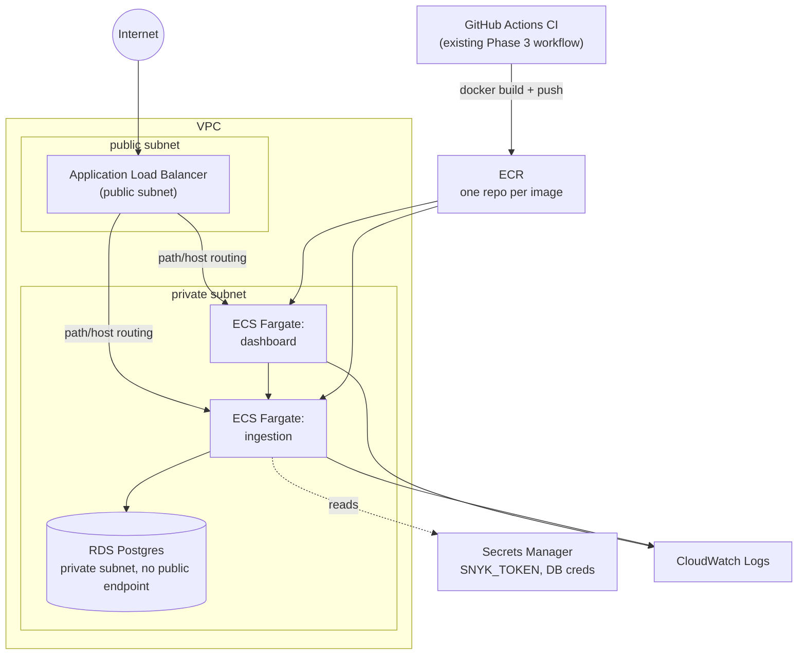

# PRD — Phase 7: AWS Deployment via Terraform

**Status:** Not started (Phase 7 of `Plan_vigilant_engine.md`).
**Owner:** Deepesh Dang
**Last updated:** 2026-09-15
**Relationship to main project:** infrastructure for the existing
`vigilant-engine` app (see [docs/PRD.md](PRD.md)) — no application code
changes, just moving the already-built Phase 5 `docker-compose` stack
onto real AWS infrastructure, provisioned through Terraform.

## 1. Problem

Phases 1-6 prove the pipeline works — scanners run, findings normalize
and dedupe correctly, the dashboard renders real data — but only ever
against short-lived local containers or a CI runner. Nothing in the
project currently demonstrates the other half of an AppSec engineer's
expected skill set: standing up cloud infrastructure that hosts an app
*correctly from a security standpoint* — private data tier, no
hardcoded secrets, network access scoped to what's actually needed. A
portfolio piece that only ever ran on `localhost` and inside GitHub
Actions can't back up an AWS/Terraform/cloud-security line on a CV.

## 2. Goal

A real, reachable public URL serving the dashboard, backed by a
Postgres RDS instance holding real ingested findings, all provisioned
by Terraform rather than clicked together in the console — with the
same non-negotiable security defaults from `Plan_vigilant_engine.md`'s
Phase 7 section treated as done-on-day-one, not deferred hardening:

- RDS in a private subnet, no public endpoint.
- No hardcoded secrets — `SNYK_TOKEN` and DB credentials come from AWS
  Secrets Manager (or Terraform variables), read via ECS's `secrets`
  block.
- Security groups scoped to only the traffic that needs to flow
  (ALB → ECS, ECS → RDS) — not wide open by default.

These aren't stretch goals bolted on later; the plan is to write
`network.tf`/`rds.tf`/`secrets.tf` this way the first time, because it
costs nothing extra to get right up front and a lot more to retrofit.

### Non-goals (this phase specifically)

- **CI-driven / automated deploys.** The first `terraform apply` is run
  by hand from a local machine. Wiring this into `.github/workflows/`
  (build → push to ECR → apply), GitHub OIDC auth, and IaC scanning
  (`tfsec`/`checkov`) are all Phase 8 — see
  [docs/PRD.md §6/§7](PRD.md).
- **A full least-privilege IAM audit.** Phase 7's `iam.tf` avoids
  wildcard `*` policies and aims for "reasonably scoped," but a deeper
  audit pass is explicitly Phase 8's job, not this one's.
- **On-demand scanning.** No dashboard "run scan now" button. The
  pipeline stays push/PR-triggered only — once the dashboard has a
  public URL, an unauthenticated trigger would let anyone on the
  internet repeatedly kick off scans and rack up GitHub Actions
  minutes / AWS cost.
- **Kubernetes.** Phase 7 targets ECS/Fargate, not EKS — **decided
  2026-09-18**, see §7 below and
  [docs/ECS_VS_EKS_DECISION.md](ECS_VS_EKS_DECISION.md).

## 3. Users

Same audience as the main PRD: the project's author and the people
evaluating this work. The specific reader this phase is aimed at is an
interviewer probing "have you actually deployed something to AWS, or
only read about it" — Terraform-authored VPC/RDS/ECS/ALB, run by hand
once and pointed at, answers that more credibly than a diagram alone.

## 4. Architecture

Security groups (per `network.tf`): ALB accepts inbound 443/80 from the
internet and forwards only to ECS; ECS accepts only from the ALB's
security group; RDS accepts only from ECS's security group on 5432.
Nothing else is open.

## 5. Requirements by Terraform module

Full task-level checklist lives in
[Plan_vigilant_engine.md, Phase 7](../Plan_vigilant_engine.md) — kept
there, not duplicated here, so status doesn't drift between two files.
This table is the *why* behind each module, for context when picking
the checklist back up:

| File | Purpose | Why it's written this way |
| --- | --- | --- |
| `backend.tf` | Remote state: S3 bucket + DynamoDB lock table | State can't store itself — bootstrapped once by hand or a tiny separate bootstrap module before the main config runs |
| `network.tf` | VPC, public/private subnets, IGW/NAT, security groups | Private subnet for RDS/ECS is the actual security requirement this phase exists to demonstrate, not an afterthought |
| `ecr.tf` | One repo per image (`ingestion`, `dashboard`) | Matches Phase 5's two Dockerfiles 1:1 |
| `rds.tf` | Postgres, private subnet only | `ingestion/app/db.py` already reads `DATABASE_URL` from an env var — this is a deploy-time config change, not new app code |
| `ecs.tf` | Fargate task defs/services, sized minimal | Portfolio project, not production scale — right-sizing is a deliberate cost decision, not an oversight |
| `alb.tf` | Load balancer, path/host routing to both services | Single public entry point instead of exposing ECS tasks directly |
| `secrets.tf` | Secrets Manager entries for `SNYK_TOKEN`, DB creds | Tasks read via ECS's `secrets` block — nothing hardcoded or committed |
| `iam.tf` | Task execution/task roles, no wildcard policies | "Reasonably scoped" now; a deeper audit is explicitly deferred to Phase 8, not skipped |
| `logs.tf` | CloudWatch log groups per ECS service | Baseline observability — without this, a failed deploy is undebuggable |
| `variables.tf` / `outputs.tf` | ALB DNS name, ECR repo URLs, etc. | What the person running `terraform apply` actually needs printed back |

## 6. Open decision — always-on vs. deploy-and-teardown

Flagged in the Plan but not yet resolved, and worth deciding *before*
writing `rds.tf`/`ecs.tf`/`alb.tf`, since it changes what "done" means:

- **Always-on:** a real, persistently reachable URL to link from a CV
  — stronger demo value, but ongoing AWS cost for as long as it's kept
  up (RDS + Fargate + ALB + NAT gateway; the NAT gateway is typically
  the least obvious of these and runs whether or not it's used).
- **Deploy-and-teardown:** `terraform apply` run and recorded (screen
  capture or a written walkthrough), then `terraform destroy` — zero
  ongoing cost, but no live link to point at afterward, only evidence
  that it worked once.

Recommendation when this phase starts: default to deploy-and-teardown
for the first `terraform apply`, since Phase 7 has no CI automation yet
and a hand-run, unattended-for-weeks stack is more likely to drift or
get forgotten-about than a stack that's stood up, verified, screenshotted,
and torn down deliberately. Revisit "always-on" once Phase 8's
CI-driven deploy exists to keep it patched and monitored — but this is
a call to make consciously when the phase starts, not default into.

## 7. Kubernetes — decided

An AppSec job posting (Endeavour Group, surfaced 2026-09-11) named
Kubernetes specifically, which Phase 7's ECS/Fargate plan doesn't
cover. **Decided 2026-09-18: Phase 7 targets ECS/Fargate**, not EKS —
EKS's operational learning curve (kubectl, Helm, ingress controller,
IRSA, cluster upgrades) was judged too large relative to available
interview-prep time, and only 1 of 4 target postings (Endeavour) names
Kubernetes. A separate local `kind`/`minikube` cluster for K8s-
*security* concepts remains a possible future addition outside this
phase, not part of Phase 7. Full reasoning:
[docs/ECS_VS_EKS_DECISION.md](ECS_VS_EKS_DECISION.md).

## 8. Out of scope

- CI-driven deploy automation, GitHub OIDC, `tfsec`/`checkov` scanning
  of `infra/` — Phase 8.
- A full least-privilege IAM audit pass — Phase 8.
- On-demand/dashboard-triggered scanning.
- EKS or any Kubernetes-based deployment target — decided against for
  this phase, see §7 above and
  [docs/ECS_VS_EKS_DECISION.md](ECS_VS_EKS_DECISION.md).
- Multi-region, autoscaling, or any production-scale sizing — this is
  a portfolio demo, sized minimal on purpose.

## 9. Success criteria

- `terraform apply` from a clean state produces a working, reachable
  ALB URL serving the dashboard, with no manual console steps.
- RDS has no public endpoint — verified, not assumed (e.g. confirm via
  the AWS console or `aws rds describe-db-instances` that
  `PubliclyAccessible` is `false`).
- No secret value appears in Terraform source, state file diffs shown
  in a demo, or `git log` — all pulled from Secrets Manager at
  runtime.
- Security groups reviewed and confirmed to allow only ALB→ECS and
  ECS→RDS — nothing wider.
- The open decision in §6 (always-on vs. teardown) is made
  *explicitly*, with the reasoning recorded here or in
  `Plan_vigilant_engine.md`'s Phase 7 outcome notes, before or
  immediately after the first `terraform apply` — not left implicit.

## References

- [docs/ECS_VS_EKS_DECISION.md](ECS_VS_EKS_DECISION.md) — the
  ECS-vs-EKS decision (resolved: ECS, §7 above)
- [Plan_vigilant_engine.md, Phase 7](../Plan_vigilant_engine.md) — the
  task-level checklist this PRD doesn't duplicate
- [docs/PRD.md §6 (Out of scope) / §7 (Roadmap)](PRD.md) — where
  Phase 7's on-demand-scanning exclusion and roadmap slot are defined
- [ARCHITECTURE.md](../ARCHITECTURE.md) — current (pre-Phase-7) system
  diagram
- `ingestion/app/db.py` — the `DATABASE_URL` env var this phase's
  `rds.tf` targets
- `PROJECT_ROADMAP.md` (`/Users/deepeshdang/Documents/Learning/Security /notes/`)
  — the Kubernetes-vs-ECS decision record referenced in §7 above
