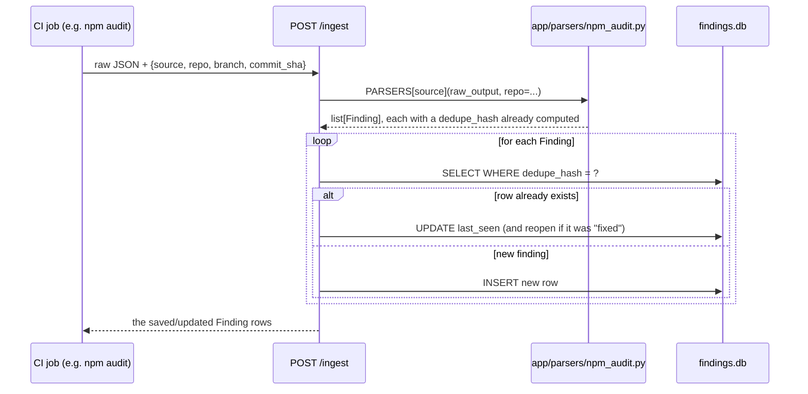
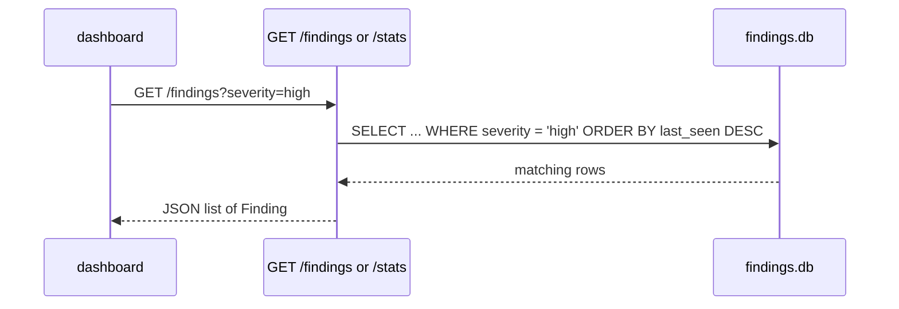

# ingestion/

The FastAPI service that turns raw scanner output into one normalized,
deduplicated findings database. See the root [ARCHITECTURE.md](../ARCHITECTURE.md)
for how this fits into the whole project.

## What each file does

```
app/
  schema.py       enums (Severity, FindingStatus, Source) + the IngestRequest/ScanRunRequest payload shapes
  models.py       Finding - the one row shape every scanner's output becomes; also the DB table.
                  ScanRun - one row per scan run, snapshotting open-finding counts by severity at
                  that moment; answers "how did the count change over time," which Finding's own
                  first_seen/last_seen can't
  dedupe.py       compute_dedupe_hash() - turns "what a finding is" into a stable hash
  db.py           SQLite engine + session, used as a FastAPI dependency
  parsers/        one module per scanner: raw JSON in, list[Finding] out
    __init__.py     PARSERS dict - maps Source -> the right parser function
    semgrep.py, npm_audit.py, snyk.py, zap.py, gitleaks.py, trivy.py
  main.py         the five HTTP routes: POST /ingest, GET /findings, GET /stats,
                  POST /scan-runs, GET /scan-runs
tests/
  fixtures/       one small, realistic sample JSON per scanner
  test_parsers.py unit tests: fixture in -> correct Finding fields out
  test_api.py     end-to-end tests: POST /ingest -> GET /findings, including the dedupe behavior
```

## Code flow

**Ingesting a scan result** (what happens on `POST /ingest`):



**Reading findings** (what the dashboard will call):



The important property: **the dashboard never imports a parser, and a
parser never talks to the database.** Everything flows through the
`Finding` shape in the middle - that's the entire point of normalizing
scanner output before storing it.

## Running it locally

```bash
cd ingestion
python3 -m venv .venv && source .venv/bin/activate
pip install -r requirements.txt

uvicorn app.main:app --reload --port 8000
# then open http://localhost:8000/docs for interactive API docs
```

Try it end-to-end with a real scan result:

```bash
cd ../demo-target && npm audit --json > /tmp/audit.json
cd ../ingestion
python3 -c "import json; json.dump({'source':'npm_audit','repo':'demo-target','raw_output':json.load(open('/tmp/audit.json'))}, open('/tmp/payload.json','w'))"
curl -X POST http://localhost:8000/ingest -H "Content-Type: application/json" --data @/tmp/payload.json
curl http://localhost:8000/stats
```

## Running the tests

```bash
source .venv/bin/activate
python -m pytest -q
```

Two kinds of test, on purpose:

- `test_parsers.py` checks the normalization logic in isolation - no
  database, no HTTP, just "does this tool's raw JSON become the right
  `Finding` fields."
- `test_api.py` checks the full request/response loop, including the
  dedupe-on-rescan behavior, against an isolated in-memory database (a
  `StaticPool`-backed SQLite engine - see the comment in `test_api.py` for
  why that specific detail matters: a plain in-memory SQLite engine hands
  out a fresh, empty database on every connection, silently breaking tests
  that expect data to persist between requests).

## Design notes worth knowing

- **Why SQLModel**: one class (`Finding`) is both the database table and the
  API's request/response schema. No separate ORM model and pydantic schema
  to keep in sync by hand.
- **Why dedupe by hash, not by scanner-provided ID**: not every scanner
  gives findings a stable ID (gitleaks doesn't), and IDs that do exist
  aren't comparable across tools. Hashing the fields that identify *what*
  a finding is (see each parser's call to `compute_dedupe_hash`) works
  uniformly for all of them.
- **Simplification**: returning the `Finding` table model directly as the
  API response means every column is exposed as-is. Fine for an internal
  tool; a public API would typically add a separate, narrower response
  model instead.
